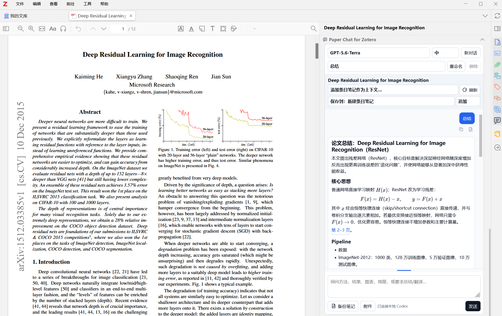

# Paper Chat for Zotero

[简体中文](README.zh-CN.md) · [Installation](docs/installation.en.md) · [Usage](docs/usage.en.md) · [Latest release](https://github.com/Suzuka24/paper-chat-for-zotero/releases/latest)

Chat with the paper currently open in Zotero, directly from its native sidebar. Paper Chat for Zotero reuses your local Codex sign-in, so it does not require an OpenAI API key or API credits.

> **First-time setup:** Installing the XPI alone is not sufficient. Download the source archive and run the Windows or macOS installer first so that the local bridge is installed, then install the generated XPI in Zotero. See [Quick install](#quick-install).



## Highlights

- Uses the current PDF, selections, annotations, Zotero notes, and local attachments as context.
- Supports account-aware models, reasoning effort, streaming responses, and persistent conversations.
- Provides live web search for sources beyond the paper, with cached and disabled modes available in preferences.
- Keeps plugin-managed tasks out of Codex **Recent** by archiving completed conversations while retaining resumable context.
- Renders Markdown, tables, code, and KaTeX math, with clickable PDF page references.
- Copies or saves individual messages and complete conversations to Zotero notes.
- Follows Zotero's Chinese or English interface language.

## Quick install

Requirements: Windows 10/11 or macOS, Zotero 9.0.x, Python 3.10+, and a valid sign-in to the official Codex app or Codex CLI under the same OS account.

1. Download and extract the [latest source archive](https://github.com/Suzuka24/paper-chat-for-zotero/releases/latest), or clone this repository.
2. Run the installer for your platform.

   Windows PowerShell:

   ```powershell
   Set-ExecutionPolicy -Scope Process Bypass
   .\Install.ps1
   ```

   macOS Terminal:

   ```bash
   python3 Install-macOS.py
   ```

3. In Zotero, choose `Tools → Plugins → gear menu → Install Plugin From File` and select `dist/paper-chat-for-zotero.xpi`.
4. Fully restart Zotero and open a local PDF.

Codex does not need to remain open after you have signed in. Usage is still subject to your own ChatGPT/Codex plan, workspace policy, and limits.

## Documentation

- [Detailed installation, upgrades, and troubleshooting](docs/installation.en.md)
- [Complete usage guide](docs/usage.en.md)
- [Privacy and local data storage](PRIVACY.md)
- [Support and bug reports](SUPPORT.md)
- [Changelog](CHANGELOG.md)
- [Contributing and release process](CONTRIBUTING.md)

## License

[MIT](LICENSE). This independent project is not affiliated with or endorsed by OpenAI or Zotero. OpenAI, ChatGPT, Codex, and Zotero are trademarks of their respective owners.
